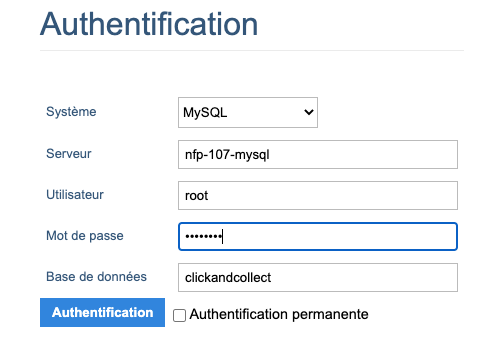
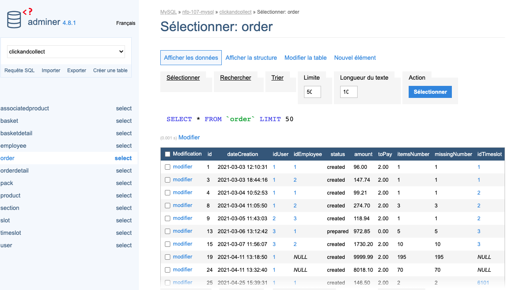
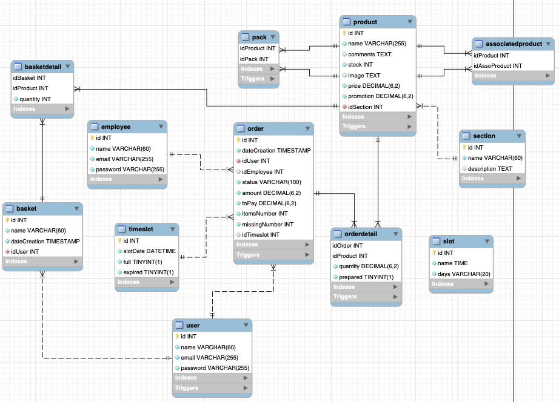
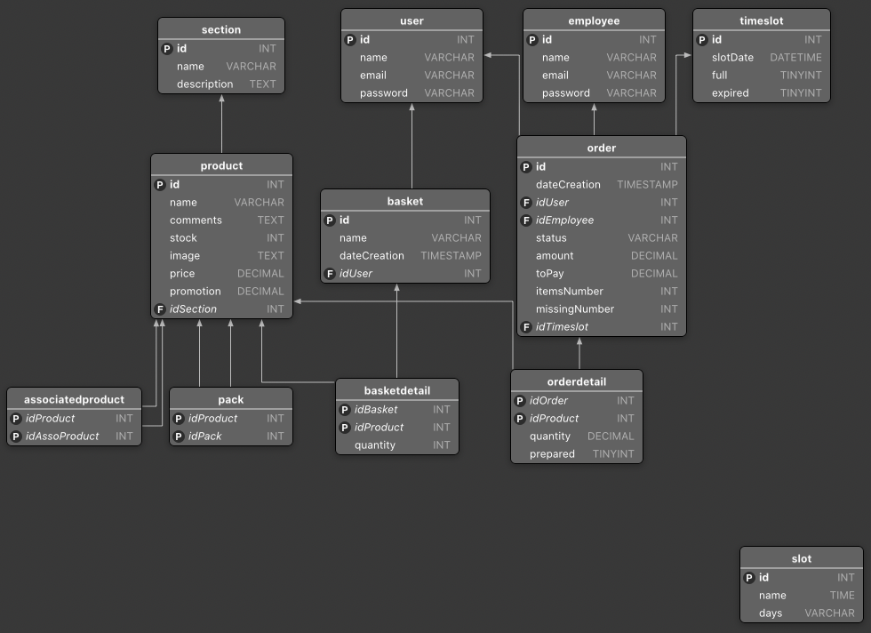

# NFP-107 - Système de gestion de base de données - TP

[Ce document consiste à commenter la réalisation de ce TP.](https://slamwiki2.kobject.net/licence/nfp107/seance9)

## Table des matières

- [NFP-107 - Système de gestion de base de données - TP](#nfp-107---système-de-gestion-de-base-de-données---tp)
  - [Table des matières](#table-des-matières)
  - [Requis](#requis)
  - [I. Importation](#i-importation)
    - [Définition de l'infrastructure via docker-compose](#définition-de-linfrastructure-via-docker-compose)
    - [Adminer](#adminer)
  - [II. Retroconception](#ii-retroconception)
    - [*MySqlWorkbench*](#mysqlworkbench)
    - [*Querious*](#querious)
    - [Déduction des règles métiers](#déduction-des-règles-métiers)
  - [Optimisation du stockage](#optimisation-du-stockage)
  - [Compréhension du SI](#compréhension-du-si)
    - [Règles de gestion](#règles-de-gestion)
    - [Trigger](#trigger)
  - [optimisation de requêtes](#optimisation-de-requêtes)
    - [Description des produits](#description-des-produits)
    - [Order status](#order-status)
  - [Symfony](#symfony)
    - [Détails commande](#détails-commande)
    - [Mise à jour de la préparation d'order](#mise-à-jour-de-la-préparation-dorder)
    - [Validation de panier](#validation-de-panier)
  - [ORMs](#orms)
  - [Ressources](#ressources)

## Requis

`docker version >= 20.10.11`

`docker-compose version >= 1.29.2`

## I. Importation

### Définition de l'infrastructure via docker-compose

- Importation de la base de données depuis `sources/clickandcollect.sql` sur le conteneur Docker Mysql appelé `nfp-107-db`.
- Rdv sur le [docker hub](https://hub.docker.com/) afin de trouver une image `mysql`. Une des dernières versions stables est l'image [mysql:8](https://hub.docker.com/layers/mysql/library/mysql/8/images/sha256-6e866f4e8bf7e83d8c605fe0252e53219c23e4052cb22f7f23353d5bf800de63?context=explore)
- Création d'un fichier `docker-compose.yml` à la racine du projet avec le contenu suivant :

```yml
version: '3.7'
services:

  nfp-107-mysql:
    image: mysql:8
    container_name: nfp-107-mysql
    volumes:
      - ./sources/clickandcollect.sql:/docker-entrypoint-initdb.d/init.sql
      - ./.docker-volumes/mysql:/var/lib/mysql
    restart: always
    environment:
      MYSQL_ROOT_PASSWORD: password
      MYSQL_DATABASE: clickandcollect
    networks:
      - 'nfp-107'
    ports:
        3306:3306

  nfp-107-adminer:
    image: adminer:4
    restart: always
    ports:
      - 8080:8080
    networks:
      - 'nfp-107'
    environment:
      ADMINER_DESIGN: pepa-linha
      ADMINER_DEFAULT_SERVER: nfp-107-mysql
    depends_on:
      - nfp-107-mysql
    
networks:
  nfp-107: {}
```

On définit 2 services, `mysql` et `adminer`. 

Les données MySQL seront persistées dans le dossier `.docker-volumes` grâce à la déclaration de volume : `./.docker-volumes/mysql:/var/lib/mysql`.

A la création de la base de données, si celle ci est vide, le fichier `clickandcollect.sql` sera chargé grâce au volume `./sources/clickandcollect.sql:/docker-entrypoint-initdb.d/init.sql`.

Ouvrir un terminal et se placer dans la racine du projet, lancer l'infrastructure avec la commande suivante : `docker-compose up -d`

### Adminer

Rendez-vous sur `http://localhost:8080/` et remplir les champs comme ceci:



Si la configuration est bonne, on devrait avoir ça :



## II. Retroconception  
A l'aide de MysqlWorkbench, un reverse ingeneering de la base de données va être effectué. On va passer du SQL au modèle conceptuel de données (MCD). 

### *MySqlWorkbench*

- Cliquer sur l'onglet `Database` > `Reverse Engineer` et choisir la base de donnée concernée.
- Cela devrait faire apparaître le schéma suivant :



### *Querious*

- Cliquer sur `View` puis `Structure` dans le menu.



### Déduction des règles métiers

- Le système contient des utilisateurs pouvant détenir des commandes (order) et des paniers (basket). Ces dernier peuvent contenir plusieurs produits (product ) qui eux même peuvent se retrouver dans plusieurs paniers. 
- Les commandes ont une durée de vie (timeslot) avec une date d'expiration.
- Le système comporte des employés pouvant être responsable de commandes.
- Lorsqu'un achat est effectué, une facture contenant la liste des produit pour une commande est établie (orderDetail)
- Un produit peut être associé à un autre produit (associatedproduct) et faire parti d'un paquet (pack). Les produits sont rangés par catégorie (section).

## Optimisation du stockage

Après vérification et analyse de la base de données, on peut effectuer les optimisations suivantes :

- Remarques générales
  - On pourrait changer tous les prix qui sont en décimals en entier en prenant pour unité le centime, exemple : 194,57 devient 19457. Cela simplifira les calculs coté applicatif et évitera de devoir effectuer des arrondis inutiles.
- Table order
  - Changer le status en un entier par une enumération car les status sont inscrits en dur dans une chaîne de caractère ce qui limite l'évolution ou le chanhement.
- Table orderdetail
  - La colonne quantité ne possède que des nombress décimaux ne contenant que des zéros après la virgule, on pourrait simplifier ça par des entiers.
- Table user et employee
  - On pourrait transférer la clé primaire sur l'email pour la rendre unique et éviter les problèmes de duplication.
  - ~~On pourrait fusionner la table user et employee pour simplifier le modèle.~~ 
- Table slot
  - On peut stocker les jours de la semaine par un enum coté applicatif allant de 0 à 4 et représentant les jours de la semaine. 

## Compréhension du SI
### Règles de gestion
### Trigger

## optimisation de requêtes
### Description des produits
### Order status

## Symfony
### Détails commande
### Mise à jour de la préparation d'order
### Validation de panier

## ORMs

## Ressources

- [Lien pour générer la table des matières](https://gist.github.com/JamieMason/c43e7ee1d078fc63e7c0f15746845c2e)